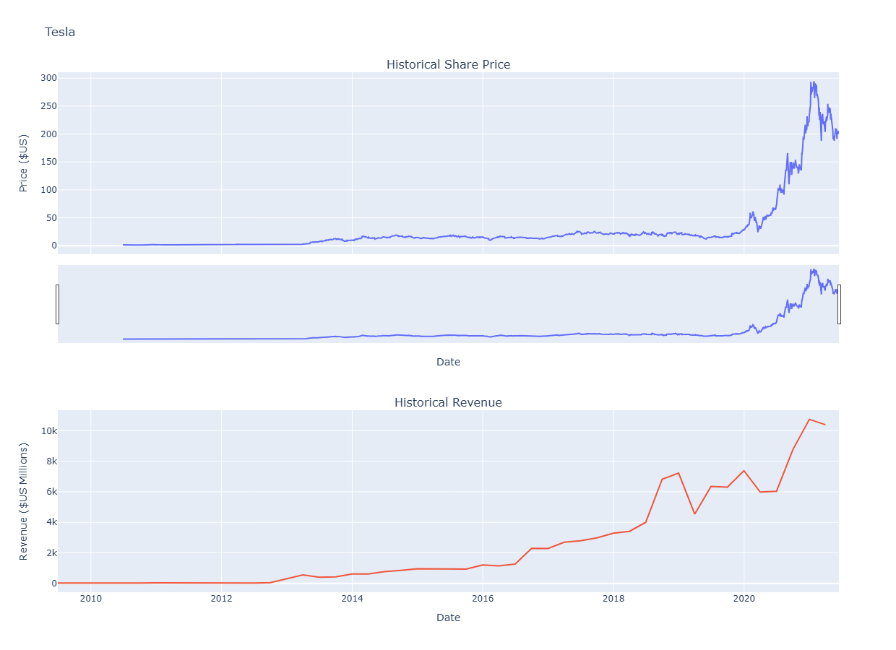
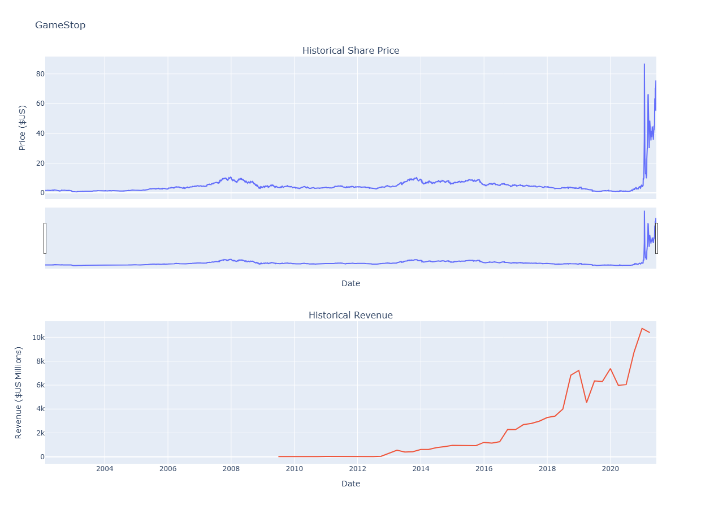

# 📊 Tesla & GameStop Stock and Revenue Dashboard

This repository contains my submission for the **IBM Data Science Professional Certificate** peer-graded assignment:  
**Analyzing Historical Stock/Revenue Data and Building a Dashboard**.

---

## 📌 Project Description
In this project, I used Python to:  
- Extract **historical stock data** for Tesla (TSLA) and GameStop (GME) using the `yfinance` library.  
- Scrape **quarterly revenue data** for both companies from a webpage using `requests` and `BeautifulSoup`.  
- Clean and organize the data with **pandas**.  
- Build interactive **visualizations and dashboards** with `plotly`.  

The goal is to analyze trends in stock prices and revenue history for both Tesla and GameStop.

---

## 🚀 Technologies Used
- Python 3  
- pandas  
- requests  
- BeautifulSoup  
- yfinance  
- plotly  

---

### Tesla Stock Graph

### GameStop Stock Graph

---

## 📌 Important Note for Reviewers

Due to GitHub's limitations in rendering interactive Plotly outputs directly in the notebook view, some plots may **not appear** when viewing the notebook on GitHub.

**To see all plots and interactive outputs:**

1. Download the notebook by clicking **Download** in GitHub.  
2. Open the `.ipynb` file in **Jupyter Notebook** or **JupyterLab** on your computer.  

---

